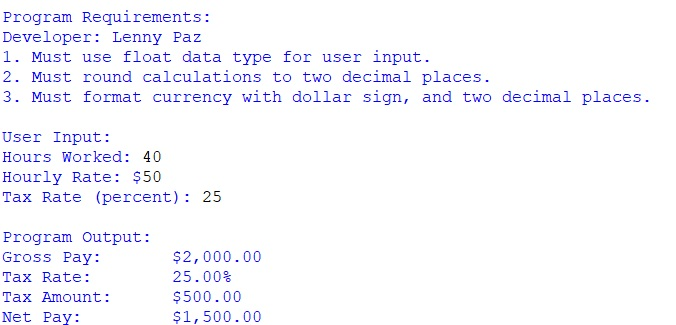
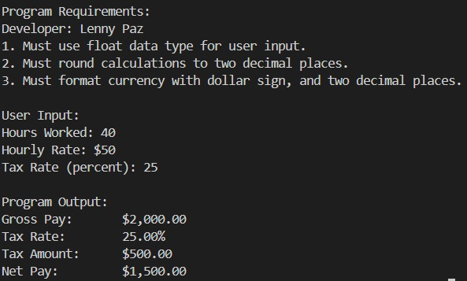
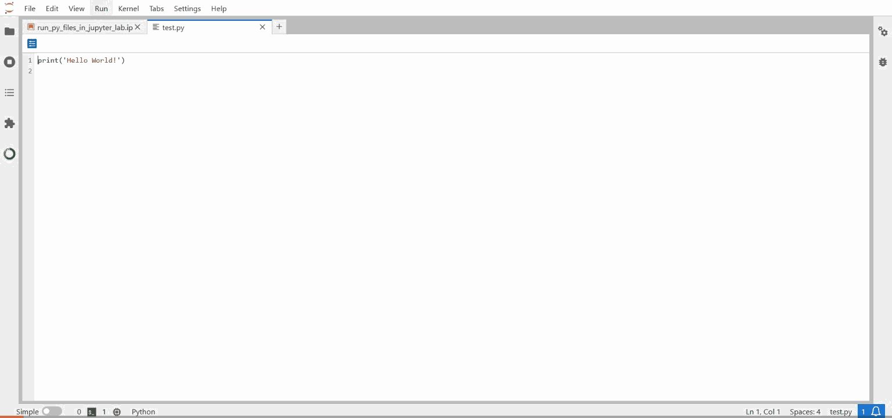

# LIS4376 - Artificial Intelligence Applications

**Developer:** Lenny Paz

### Assignment 1 Requirements:

*Four Parts:*

1. Distributed Version Control with Git and Bitbucket
2. Development Installations
3. Questions
4. Bitbucket repo (main) link

---

### README.md file should include the following items:

- Screenshot of a1_paycheck_calculator application running
- Links to A1 .ipynb files:
    - [a1_paycheck_calculator.ipynb](a1_paycheck_calculator.ipynb)
    - [run_py_files_in_jupyter_lab.ipynb](run_py_files_in_jupyter_lab.ipynb)
    - [magic_commands.ipynb](magic_commands.ipynb)
- git commands w/short descriptions

---

### Git commands w/short descriptions:

1. **git init** - Initializes a new Git repository in the current directory
2. **git status** - Shows the current state of the working directory and staging area
3. **git add** - Adds file changes to the staging area for the next commit
4. **git commit** - Records staged changes to the repository with a message
5. **git push** - Uploads local repository commits to a remote repository
6. **git pull** - Fetches and merges changes from a remote repository to local
7. **git clone** - Creates a copy of an existing remote repository locally

---

### Assignment Screenshots:

#### Screenshot of a1_paycheck_calculator application running (IDLE):

#### Screenshot of a1_paycheck_calculator application running (Visual Studio Code):

#### Demo of a1_paycheck_calculator.ipynb (Jupyter Lab):

#### Demo of run_py_files_in_jupyter_lab.ipynb (Jupyter Lab):

#### Demo of magic_commands.ipynb (Jupyter Lab):

