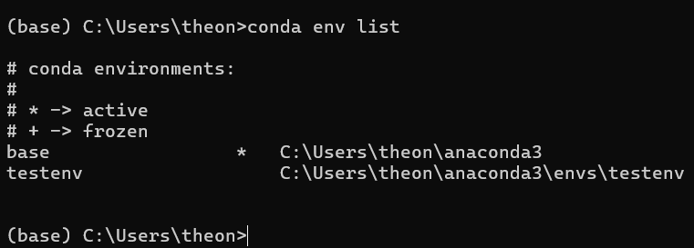
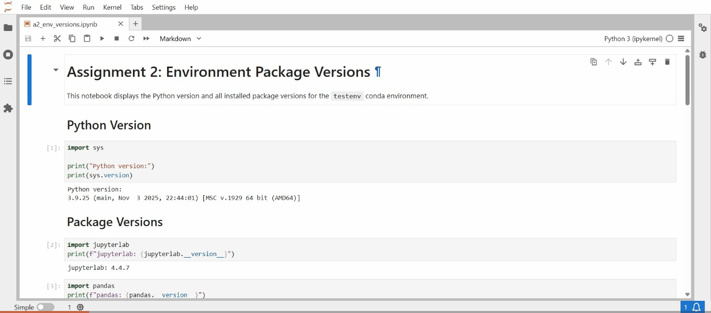
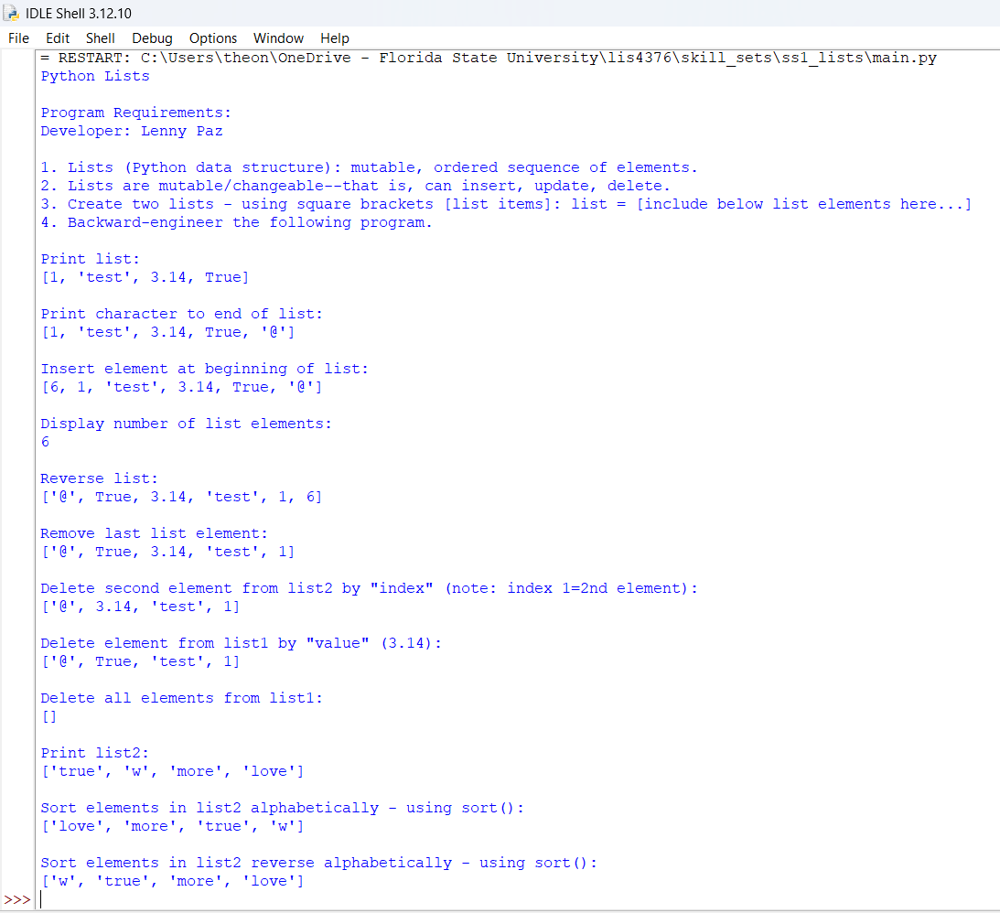
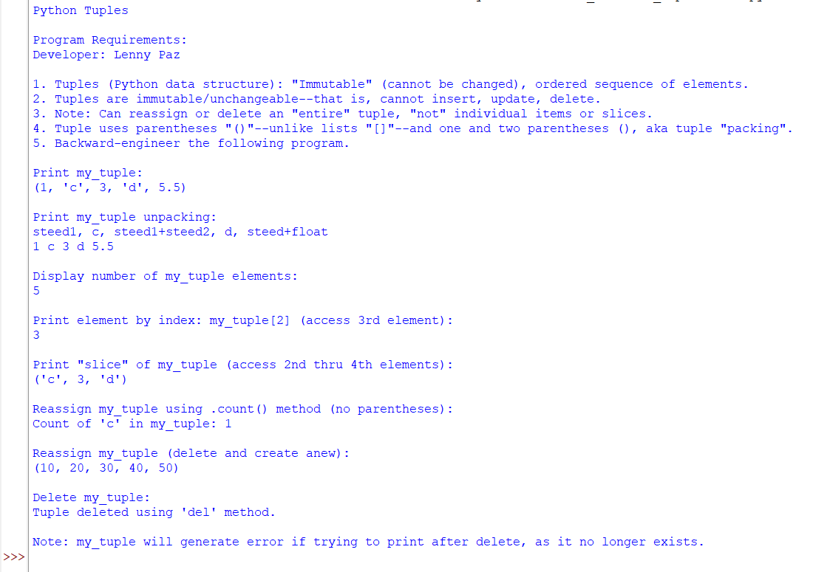
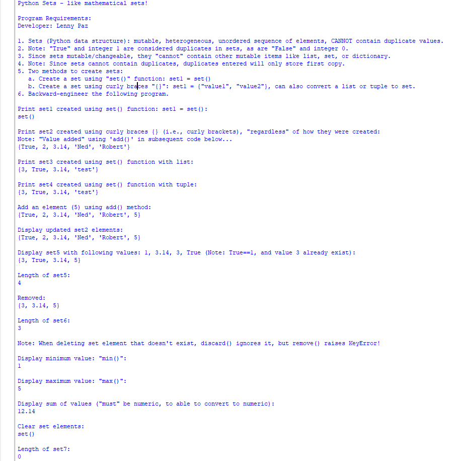

# Assignment 2: Python Conda Environments

**Developer:** Lenny Paz

**Course:** LIS4376 - Artificial Intelligence Applications

## Assignment 2 Requirements

*Four Parts:*

1. Create conda environment
2. Design principles: Separation of Concerns
3. Data sets: Examining, sorting, shaping, and analyzing
4. Bitbucket repo (main) link

---

## Files

| File | Description |
|------|-------------|
| [a2.ipynb](a2.ipynb) | Main assignment notebook - mortality data analysis |
| [a2_env_versions.ipynb](a2_env_versions.ipynb) | Jupyter notebook displaying package versions |
| [my_env_versions.py](my_env_versions.py) | Python script displaying package versions |
| [testenv.yml](testenv.yml) | Exported conda environment specification |

## Conda Environment

The `testenv` environment was created with Python 3.9 and includes the following packages:

**Installed via conda:**

- jupyterlab
- pandas
- pandas-datareader
- numpy
- matplotlib
- scikit-learn
- django
- seaborn
- nltk
- statsmodels
- scipy

**Installed via pip:**

- tensorflow
- opencv-python
- keras

### Environment List



## Running the Version Script

Activate the environment and run the script:

```bash
conda activate testenv
python my_env_versions.py
```

### Output



## Environment Setup Commands

To recreate this environment:

```bash
# Create environment with conda packages
conda create -n testenv python=3.9 jupyterlab pandas pandas-datareader numpy matplotlib scikit-learn django seaborn nltk statsmodels scipy

# Activate environment
conda activate testenv

# Install pip packages
pip install tensorflow
pip install opencv-python
pip install keras

# Export environment
conda env export > testenv.yml
```

Or import from the YAML file:

```bash
conda env create -f testenv.yml
```

---

## Skill Sets (SS1-SS3)

The following skill sets demonstrate Python data structures using a two-file, "separation of concerns" design principle.

| [📁 SS1 - Python Lists](../skill_sets/ss1_lists/) | [📁 SS2 - Python Tuples](../skill_sets/ss2_tuples/) | [📁 SS3 - Python Sets](../skill_sets/ss3_sets/) |
|:---:|:---:|:---:|
|  |  |  |
