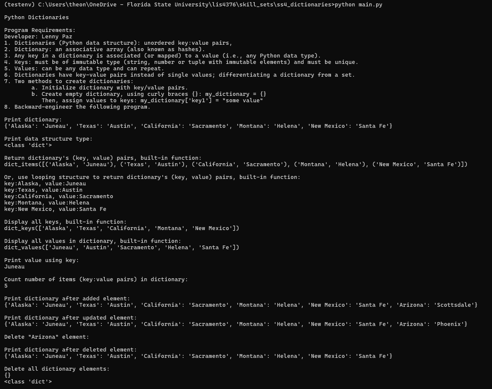
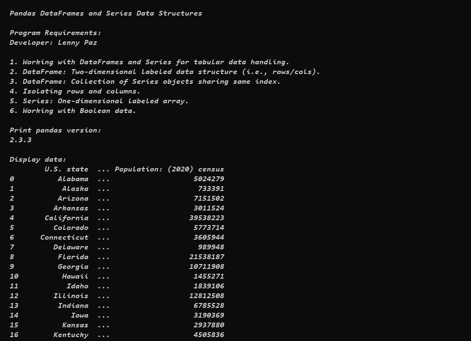
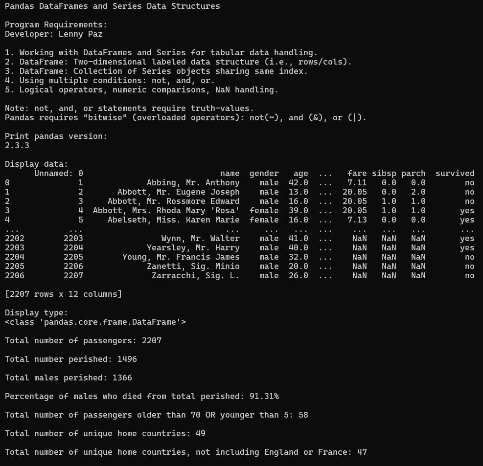

# Assignment 3: Data Analysis, Shaping and Visualization

## Developer: Lenny Paz

**Course:** LIS4376 - Artificial Intelligence Applications

## Assignment 3 Requirements

*Two Parts:*

1. Development: Backward-engineer the helper video using Python
2. README.md file with screenshots and Jupyter Notebook link

---

## Demo

---

## Files

| File | Description |
|------|-------------|
| [a3.ipynb](a3.ipynb) | Main assignment notebook - comprehensive data analysis and visualization |
| mortality_cleaned.pkl | Cleaned mortality data from Assignment 2 |
| mortality_prepped.pkl | Prepared mortality data with additional columns |
| mortality_wide.pkl | Wide-format mortality data (pivot) |
| mortality_wide.xlsx | Excel export of wide-format data |

## Assignment Overview

This assignment demonstrates comprehensive data analysis, shaping, and visualization techniques using pandas. The notebook is organized into 12 sections:

1. **Environment & Imports** - Setup and configuration
2. **Data Loading** - Reading cleaned data from Assignment 2
3. **Initial Data Inspection** - Examining DataFrame structure
4. **Sorting Data** - Various sorting operations
5. **Statistical Functions** - Mean, max, count operations
6. **Quantiles & Cumulative Sum** - Percentile and cumulative analysis
7. **Column Arithmetic** - Creating derived columns (Mean, MeanCentered)
8. **Data Modification & File Operations** - String manipulation and file I/O
9. **Indexing** - Single and multi-index operations
10. **Pivot & Melt** - Reshaping between wide and long formats
11. **Grouped Data & Aggregates** - GroupBy operations with multiple aggregation functions
12. **Visualization** - Comprehensive plotting (line, box, bar, pie, scatter, subplots)

## Data Analysis Workflow

The notebook follows a five-step data science workflow:

1. **Get** - Load cleaned mortality data
2. **Clean** - Verify data quality
3. **Prepare** - Sort, transform, and reshape data
4. **Analyze** - Apply statistical functions and aggregations
5. **Display/Visualize** - Create multiple chart types

## Key Techniques Demonstrated

### Data Manipulation
- DataFrame sorting (single and multiple columns)
- Index management (set_index, reset_index, multi-index)
- Column arithmetic and mean centering
- String value replacement (zero-filling age groups)

### Statistical Analysis
- Descriptive statistics (mean, median, max, count)
- Quantile analysis (10%, 50%, 90%)
- Cumulative sum calculations
- GroupBy aggregations (single and multiple functions)

### Data Reshaping
- **Pivot (Wide Format):** Transform long data to wide format with years as index and age groups as columns
- **Melt (Long Format):** Convert wide data back to long format for specific analysis
- Excel and pickle file operations

### Visualization Types
- Line plots (time series)
- Box plots (distribution analysis)
- Bar charts (vertical and horizontal)
- Pie charts (proportional data)
- Scatter plots (relationship analysis)
- Subplots (2x2 layout for comparative analysis)

---

## Skill Sets (SS4-SS6)

Skill sets use a two-file "separation of concerns" design: `main.py` runs the program, `functions.py` contains reusable functions.

### SS4 - Python Dictionaries

[📁 Source Code](../skill_sets/ss4_dictionaries/) · [main.py](../skill_sets/ss4_dictionaries/main.py) · [functions.py](../skill_sets/ss4_dictionaries/functions.py)

### SS5 - Pandas DataFrames and Series 1

[📁 Source Code](../skill_sets/ss5_pandas_df_and_series_1/) · [main.py](../skill_sets/ss5_pandas_df_and_series_1/main.py) · [functions.py](../skill_sets/ss5_pandas_df_and_series_1/functions.py)

### SS6 - Pandas DataFrames and Series 2

[📁 Source Code](../skill_sets/ss6_pandas_df_and_series_2/) · [main.py](../skill_sets/ss6_pandas_df_and_series_2/main.py) · [functions.py](../skill_sets/ss6_pandas_df_and_series_2/functions.py)

