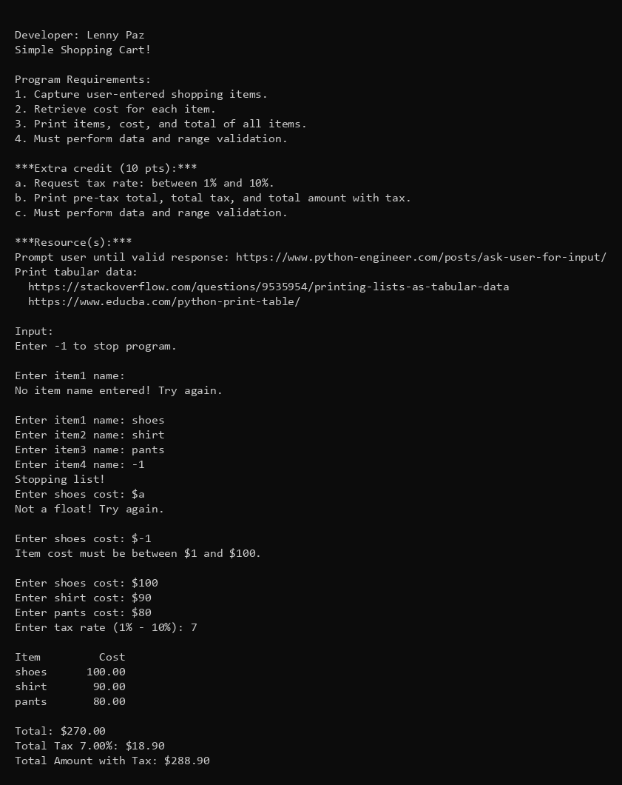
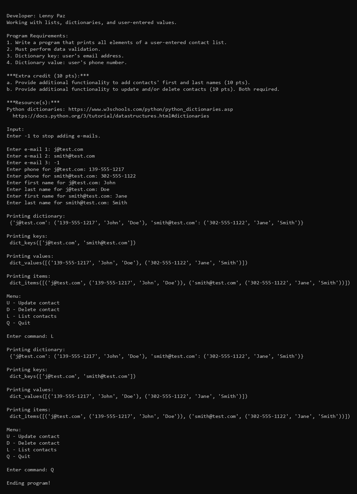
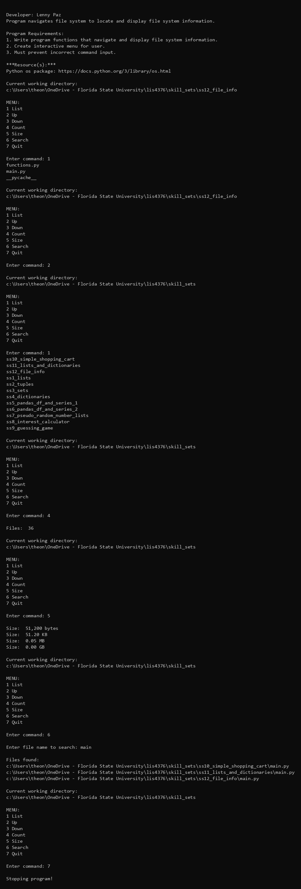

# Assignment 4: Predictive Analysis (Simple Linear Regression)

## Developer: Lenny Paz

**Course:** LIS4376 - Artificial Intelligence Applications

## Assignment 4 Requirements

*Three Parts:*

1. Development: Backward-engineer the helper video using Python
2. README.md file with screenshots and Jupyter Notebook link
3. Questions (Chs. 9, 10)

---

## Demo

---

## Files

| File | Description |
|------|-------------|
| [a4.ipynb](a4.ipynb) | Simple linear regression analysis on advertising data |
| my_company_data.csv | Advertising spend (TV, Radio, Newspaper) and Sales data (200 rows) |

## Assignment Overview

This assignment demonstrates **predictive analysis using simple linear regression** on advertising data. The notebook walks through the full machine learning workflow: data exploration, correlation analysis, model training, evaluation, and visualization.

### Regression Analysis Workflow

1. **Data Exploration** - Load and inspect the advertising dataset (TV, Radio, Newspaper spend vs. Sales)
2. **Correlation Analysis** - Identify relationships between variables using `.corr()`, pairplots, and heatmaps
3. **Feature Selection** - Focus on TV ads as the strongest predictor of Sales (r = 0.90)
4. **Train/Test Split** - Split data 70/30 for training and testing
5. **Model Fitting** - Train a LinearRegression model using scikit-learn
6. **Evaluation** - Compare R2 scores (training ~0.82, testing ~0.79)
7. **Visualization** - Plot regression line and residuals using Seaborn

### Key Techniques Demonstrated

- Pairwise correlation analysis with `corr()` method
- Seaborn visualizations: `pairplot()`, `relplot()`, `heatmap()`, `regplot()`, `residplot()`
- Train/test split with `train_test_split()` (random_state=100)
- Linear regression with scikit-learn (`LinearRegression`, `fit`, `predict`)
- R2 scoring with `r2_score()` for model evaluation
- Residual analysis with LOWESS smoothing

---

## Skill Sets (SS10-SS12)

Skill sets use a two-file "separation of concerns" design: `main.py` runs the program, `functions.py` contains reusable functions.

### SS10 - Simple Shopping Cart

[Source Code](../skill_sets/ss10_simple_shopping_cart/) · [main.py](../skill_sets/ss10_simple_shopping_cart/main.py) · [functions.py](../skill_sets/ss10_simple_shopping_cart/functions.py)

### SS11 - Lists and Dictionaries

[Source Code](../skill_sets/ss11_lists_and_dictionaries/) · [main.py](../skill_sets/ss11_lists_and_dictionaries/main.py) · [functions.py](../skill_sets/ss11_lists_and_dictionaries/functions.py)

### SS12 - File Info

[Source Code](../skill_sets/ss12_file_info/) · [main.py](../skill_sets/ss12_file_info/main.py) · [functions.py](../skill_sets/ss12_file_info/functions.py)

