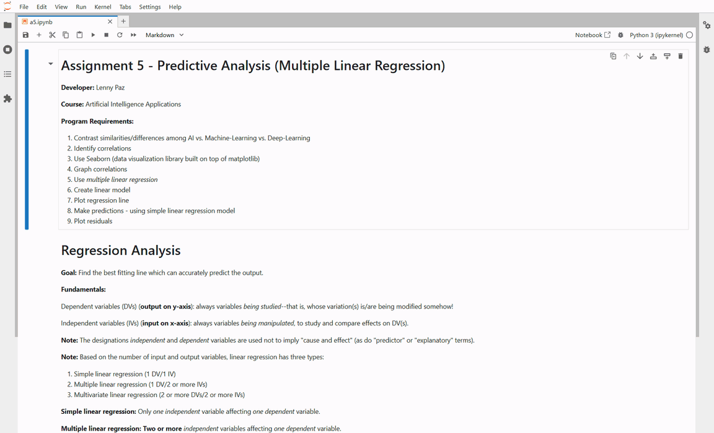
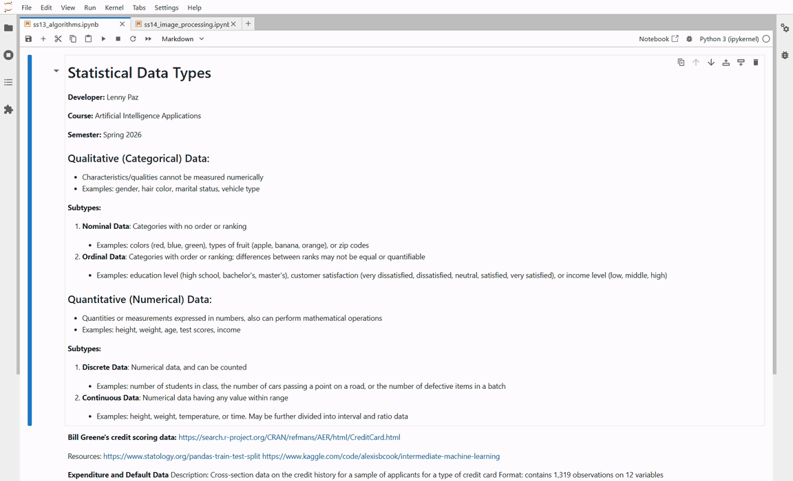
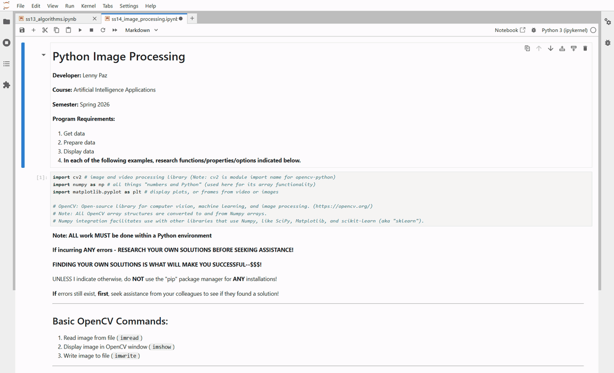

# Assignment 5: Predictive Analysis (Multiple Linear Regression)

## Developer: Lenny Paz

**Course:** LIS4376 - Artificial Intelligence Applications

## Assignment 5 Requirements

*Three Parts:*

1. Development: Backward-engineer the helper video using Python
2. README.md file with screenshots and Jupyter Notebook link
3. Skill Sets (SS13-SS15)

---

## Demo

---

## Files

| File | Description |
|------|-------------|
| [a5.ipynb](a5.ipynb) | Multiple linear regression analysis on fish measurement data |
| fish.csv | Fish species measurements: weight, lengths, height, width (159 rows) |

## Assignment Overview

This assignment demonstrates **predictive analysis using multiple linear regression** on fish measurement data. The notebook walks through the full machine learning workflow: data exploration, correlation analysis, model training, evaluation, and residual analysis.

### Regression Analysis Workflow

1. **Data Exploration** - Load and inspect the fish dataset (7 species, 159 observations)
2. **Data Cleaning** - Rename length columns for clarity (VerticalLength, DiagonalLength, CrossLength)
3. **Correlation Analysis** - Identify relationships using `.corr()`, pairplots, and heatmaps
4. **Feature Selection** - Focus on Bream species with Height, Width, and VerticalLength as predictors
5. **Train/Test Split** - Split data 80/20 for training and testing
6. **Model Fitting** - Train a LinearRegression model using scikit-learn
7. **Evaluation** - Compare R2 scores for training and testing sets
8. **Residual Analysis** - Plot residuals with KDE to assess model fit

### Key Techniques Demonstrated

- Multiple linear regression with multiple independent variables
- Seaborn visualizations: `pairplot()`, `heatmap()`, `color_palette()`, `displot()`
- Train/test split with `train_test_split()` (random_state=42)
- Linear regression with scikit-learn (`LinearRegression`, `fit`, `predict`, `score`)
- Residual analysis with KDE (Kernel Density Estimate) plot

---

## Skill Sets (SS13-SS15)

Skill sets 13-15 are Jupyter notebook tutorials covering algorithms and image processing.

### SS13 - Algorithms

[Source Code](../skill_sets/ss13_algorithms/) · [ss13_algorithms.ipynb](../skill_sets/ss13_algorithms/ss13_algorithms.ipynb)

### SS14 - Python Image Processing

[Source Code](../skill_sets/ss14_python_image_processing/) · [ss14_image_processing.ipynb](../skill_sets/ss14_python_image_processing/ss14_image_processing.ipynb)

### SS15 - Python Image Processing 2

[Source Code](../skill_sets/ss15_python_image_processing2/) · [ss15_image_processing2.ipynb](../skill_sets/ss15_python_image_processing2/ss15_image_processing2.ipynb)

