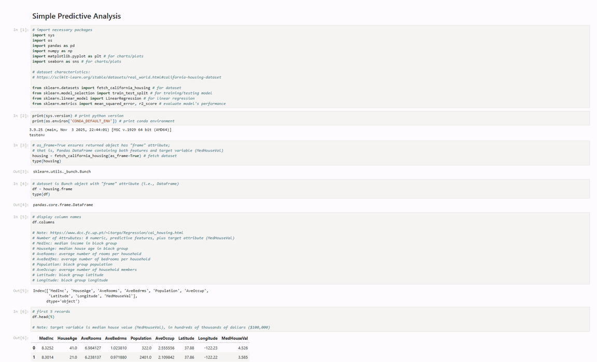
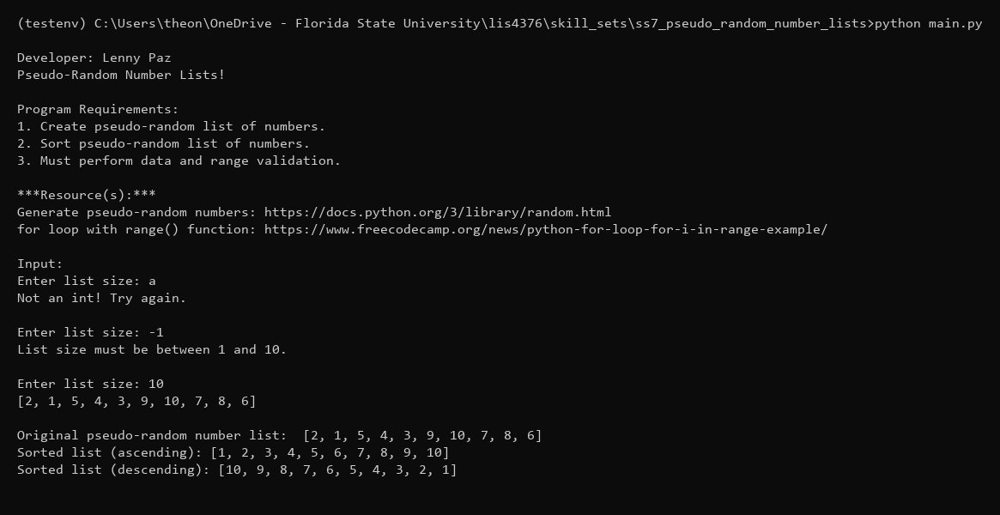
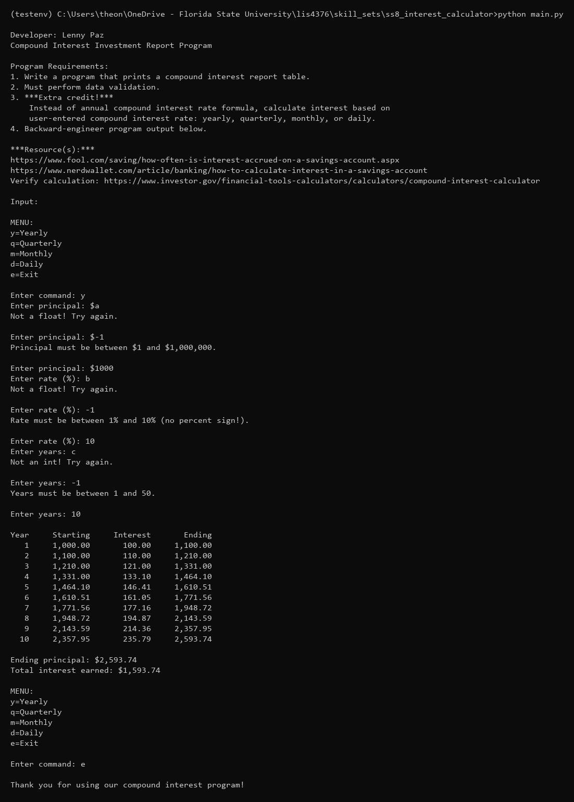
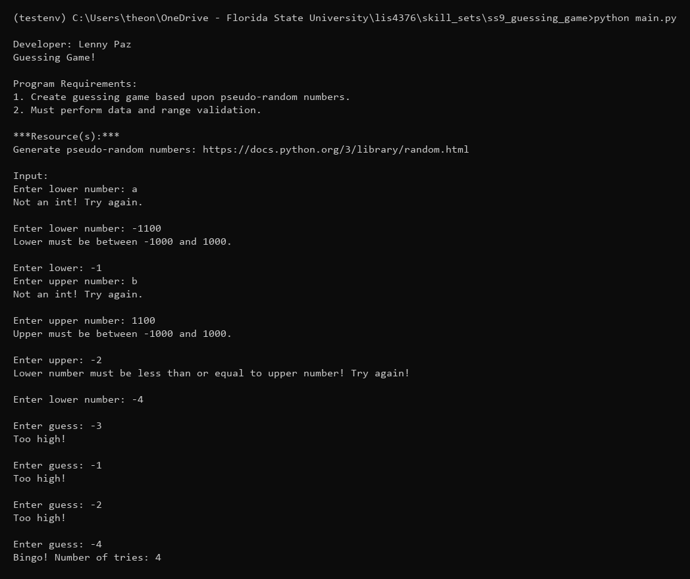

# Project 1: Text Analysis, Classification, and Prediction

## Developer: Lenny Paz

**Course:** LIS4376 - Artificial Intelligence Applications

## Project 1 Requirements

*Six Parts:*

1. JupyterLab P1 app.
2. Link to p1.ipynb file.
3. Simple Predictive Analysis app.
4. Link to Simple_predictive_analysis.ipynb file.
5. Skill Sets (7-9).
6. Bitbucket repo (main) link.

#### README.md file should include the following items:

* Text Analysis, Classification, and Prediction.
* Provide screenshot of completed P1 app.
* Provide screenshot of completed Simple_predictive_analysis app.
* Screenshot of skillset 7.
* Screenshot of skillset 8.
* Screenshot of skillset 9.
* Bitbucket repository link.

## Demo

*P1 Notebook:*

[p1.ipynb](p1.ipynb)

*Simple Predictive Analysis:*

[Simple_predictive_analysis.ipynb](Simple_predictive_analysis.ipynb)

---

## Skill Sets (SS7-SS9)

Skill sets use a two-file "separation of concerns" design: `main.py` runs the program, `functions.py` contains reusable functions.

### SS7 - Pseudo-Random Number Lists

[📁 Source Code](../skill_sets/ss7_pseudo_random_number_lists/) · [main.py](../skill_sets/ss7_pseudo_random_number_lists/main.py) · [functions.py](../skill_sets/ss7_pseudo_random_number_lists/functions.py)

### SS8 - Interest Calculator

[📁 Source Code](../skill_sets/ss8_interest_calculator/) · [main.py](../skill_sets/ss8_interest_calculator/main.py) · [functions.py](../skill_sets/ss8_interest_calculator/functions.py)

### SS9 - Guessing Game

[📁 Source Code](../skill_sets/ss9_guessing_game/) · [main.py](../skill_sets/ss9_guessing_game/main.py) · [functions.py](../skill_sets/ss9_guessing_game/functions.py)

---

## Bitbucket Repository

[https://bitbucket.org/lfp24b/lis4376](https://bitbucket.org/lfp24b/lis4376)
