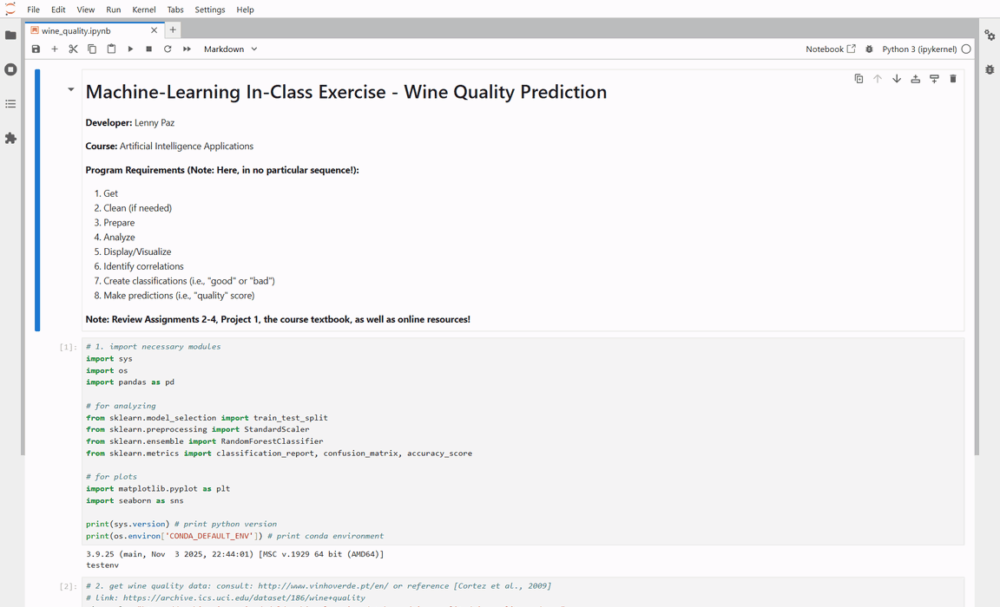

# Project 2: Deep Learning — Image Classification

## Developer: Lenny Paz

**Course:** LIS4376 - Artificial Intelligence Applications

## Project 2 Requirements

*Four Parts:*

1. JupyterLab P2 app (Convolutional Neural Network on CIFAR-10).
2. Link to p2.ipynb file.
3. In-Class Machine Learning Exercise (Wine Quality Prediction).
4. Bitbucket repo (main) link.

#### README.md file should include the following items:

* Deep Learning: Image Classification.
* Screenshot/demo of completed P2 app.
* Screenshot/demo of completed In-Class Machine Learning Exercise.
* Bitbucket repository link.

---

## Demo

*P2 Notebook (CNN / CIFAR-10):*

[p2.ipynb](p2.ipynb)

*In-Class Machine Learning Exercise — Wine Quality Prediction:*

[wine_quality.ipynb](wine_quality_exercise/wine_quality.ipynb)

---

## Files

| File | Description |
|------|-------------|
| [p2.ipynb](p2.ipynb) | CNN built with TensorFlow/Keras, trained on CIFAR-10, tested on custom animal PNGs |
| [wine_quality_exercise/wine_quality.ipynb](wine_quality_exercise/wine_quality.ipynb) | RandomForestClassifier on UCI red-wine-quality dataset |
| [img/](img/) | Custom 32x32 animal PNGs used for CNN prediction + demo assets |

## Assignment Overview

This project demonstrates **deep learning for image classification** using a Convolutional Neural Network (CNN) built with TensorFlow/Keras. The CNN is trained on the CIFAR-10 dataset — 60,000 32x32 color images across 10 object classes (aeroplane, automobile, bird, cat, deer, dog, frog, horse, ship, truck) — then evaluated against custom animal images resized to the same 32x32 input shape.

### CNN Workflow

1. **Data Load** — `cifar10.load_data()` returns `(train_images, train_labels)` and `(test_images, test_labels)` NumPy arrays (50,000 / 10,000 split).
2. **Preprocessing** — Convert pixel values to `float32`, normalize by dividing by 255.0 to constrain values to `[0, 1]`.
3. **One-Hot Encoding** — Apply `keras.utils.to_categorical()` to transform integer class labels into binary class matrices for 10-class softmax output.
4. **Model Architecture** — `Sequential` CNN with:
   - `Conv2D(32, (3,3), padding='same', activation='relu')` with `max_norm(3)` kernel constraint
   - `Dropout(0.2)`
   - Second `Conv2D(32, (3,3), activation='relu', padding='same')`
   - `MaxPooling2D(pool_size=(2,2))`
   - `Flatten()` → `Dense(512, activation='relu')` with `max_norm(3)` constraint
   - `Dropout(0.5)`
   - `Dense(num_classes, activation='softmax')` output layer
5. **Compile** — optimizer `adam`, loss `categorical_crossentropy`, metric `accuracy`.
6. **Training** — 10 epochs with batch size 32, validated against the test set. Wall-clock time recorded via `%%time` magic.
7. **Evaluation** — `model.evaluate()` on the held-out test set reports final accuracy.
8. **Persistence** — `model.save('my_model.keras')` serializes architecture, weights, and training config.
9. **Prediction** — Custom 32x32 PNG images loaded via Pillow, resized, expanded with `np.expand_dims()` to match batch shape, then classified via `model.predict()` → `np.argmax()` to get the predicted class label.

### Key Techniques Demonstrated

- Convolutional, pooling, flatten, dense, and dropout layers in a Keras `Sequential` model
- Kernel constraint (`max_norm`) to prevent overfitting
- Image normalization and one-hot encoding for multi-class classification
- `adam` optimizer with `categorical_crossentropy` loss
- Model summary, training metrics, and evaluation on held-out data
- Model persistence to `.keras` file format
- Inference on user-supplied images via PIL resize + NumPy batch-dimension expansion

---

## In-Class Machine Learning Exercise — Wine Quality Prediction

A separate required deliverable (20 pts) demonstrating **classification with a Random Forest** on the UCI red-wine-quality dataset. The notebook covers the full ML pipeline:

1. **Data Ingestion** — Load CSV directly from the UCI ML Repository URL.
2. **Exploratory Analysis** — `.shape`, `.info()`, `.describe()`, correlation heatmap.
3. **Feature Engineering** — Create binary target `is_good = (quality >= 7)`.
4. **Train/Test Split** — 80/20 split with `random_state=42`.
5. **Feature Scaling** — `StandardScaler` z-score normalization on features.
6. **Model Training** — `RandomForestClassifier` fit on scaled features.
7. **Evaluation** — `accuracy_score`, `confusion_matrix`, `classification_report`.
8. **Feature Importance** — Extract and visualize the chemical attributes that most influence wine-quality classification (Alcohol and Sulphates typically dominate).

### Why Random Forest?

- High accuracy with minimal tuning
- Built-in feature-importance scoring
- Handles mixed numerical data well
- Less prone to overfitting than a single decision tree (ensemble of bootstrapped trees)

---

## Bitbucket Repository

[https://bitbucket.org/lfp24b/lis4376](https://bitbucket.org/lfp24b/lis4376)
